# Wand Show Setup 

# All Pis
- Need special_effects repo installed. 
- Need a CUSTOM myself.py config with their own name in it 
Example: 

        myself = {
            "name": "servant_3"
        }

- Need (or will need) the special_effects.service running in the background 
- Need to auto connect to your wifi hotspot, unless using a cloud broker 
- Need to have the same topic action mapping (recent git pull if needed)

        {
            mapping = {
            "servant_1": {
                "Hola": "greet_action",
                "Hello": "other_action",
                "erratic_flowers": "erratic_flowers",
                "shaking_box": "shaking_box",
                "lantern": "lantern",
                "lantern_on": "lantern_on",
                "lantern_off": "lantern_off",
                "knock_over": "knock_over"
            },
            "servant_2": {
                "clock": "clock",
                "music_box": "music_box"
            }
        }

- Highly recommend installing tailscale so you can remote into the pis when they are headless. Will make your life better. 

## servant_1.py 

myself.py

    {
        "name": "servant_1"
    }


### Important actions:

    {
            "erratic_flowers": "erratic_flowers",
            "shaking_box": "shaking_box",
            "lantern": "lantern",
            "lantern_on": "lantern_on",
            "lantern_off": "lantern_off",
            "knock_over": "knock_over"
    } 

### Libraries: 
- apscheduling (always)
- the PCA9685 code file for the servo hat 
- serial for arduino library 

### Wiring 
#### Arduino and NeoPixel Lantern Lantern
- arduino plugged in to pi at port='/dev/ttyUSB0' (should be there by default)
- Need [HP_Light_Up_Ring.ino](../arduino_files/HP_Light_Up_Ring.ino) 
    - This needs <Adafruit_NeoPixel.h> installed. May need an old Arduino version.
- Neopixel light on **PIN 4** of Nano (CHECK Colors)
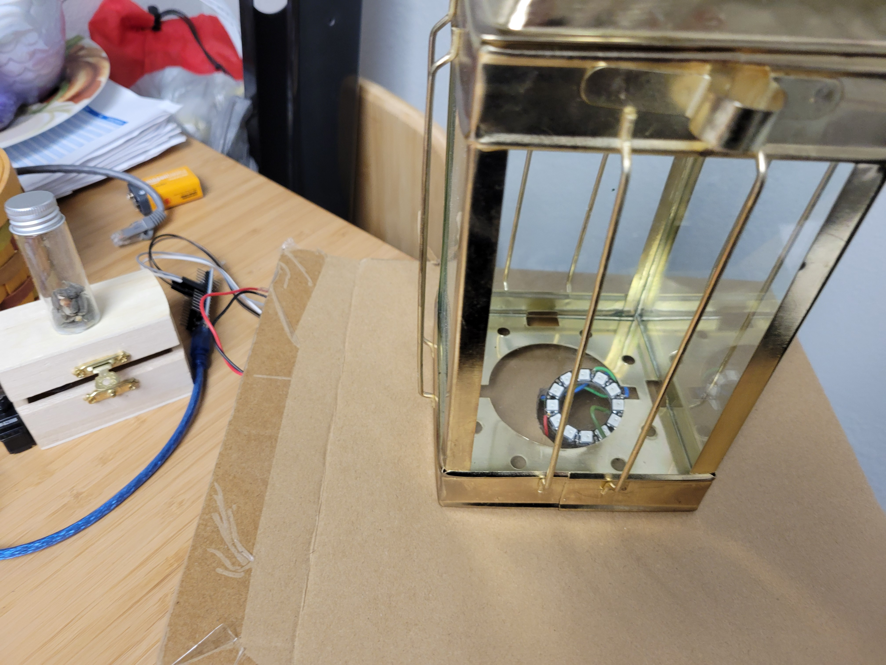

#### Servos 
All on the hat 
- Knock Over - **Section 8**
- Flowers - **Section 0**
- Box - **Section 4**

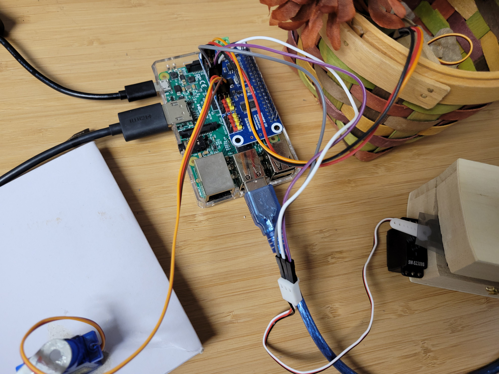
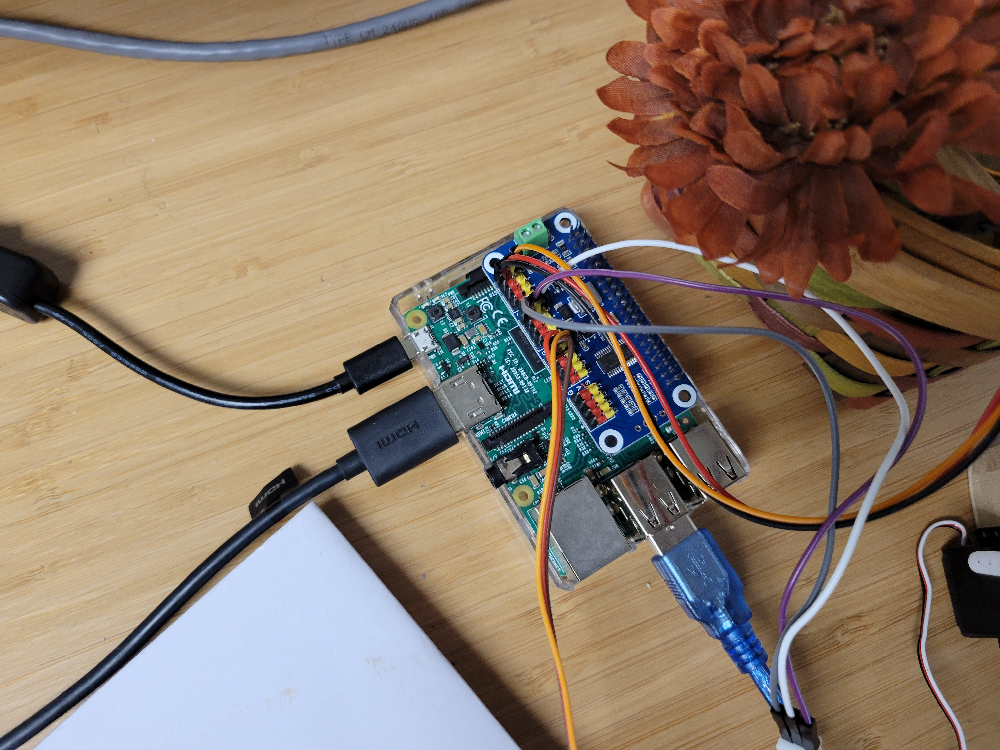
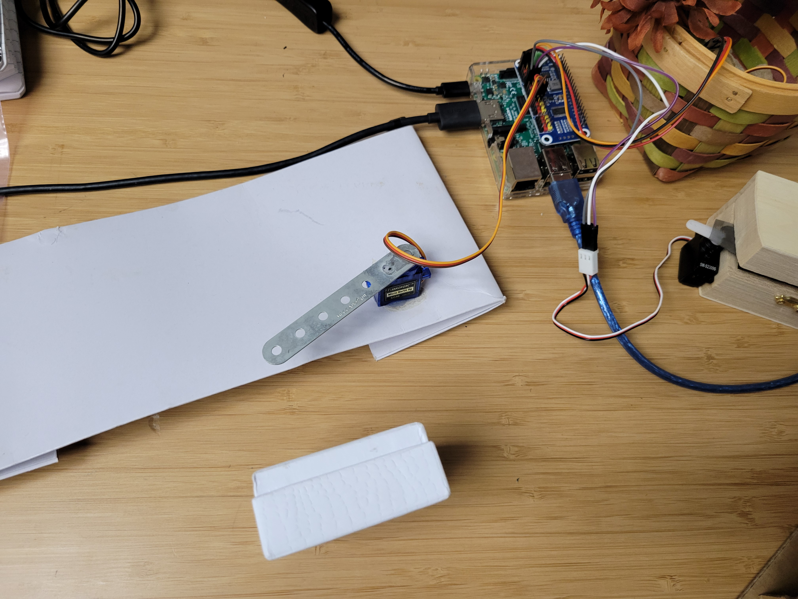
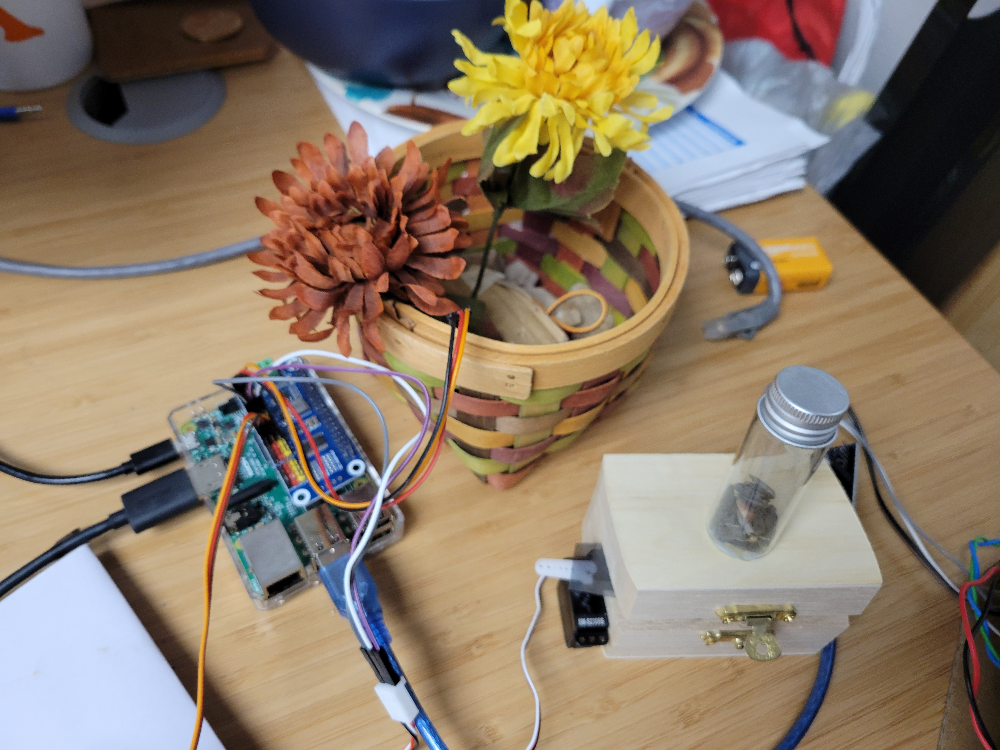


## servant_2.py 

myself.py 

    {
        "name": "servant_2"
    }

### Important actions:

    {
        "clock": "clock",
        "music_box": "music_box"
    }

### Libraries: 
- apscheduling (always)
- RPI.GPIO 

### Wiring 
#### Music Box 
GPIO - Board Mode 
- [29,31,33,35]
- 29 (orange), 31 (yellow), 33 (green), 35 (blue)
- Colors are pi side 

#### Clock
GPIO - Board Mode 
- [7,11,13,15]
- 7 (yellow), 11 (green), 13 (blue), 15 (purple)
- Colors are pi side

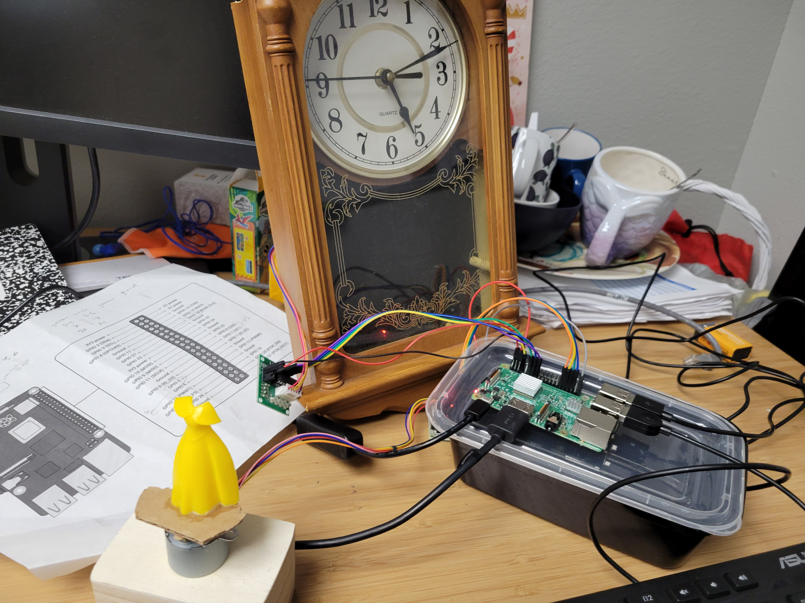
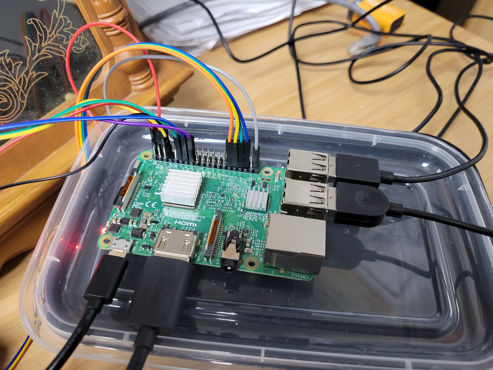
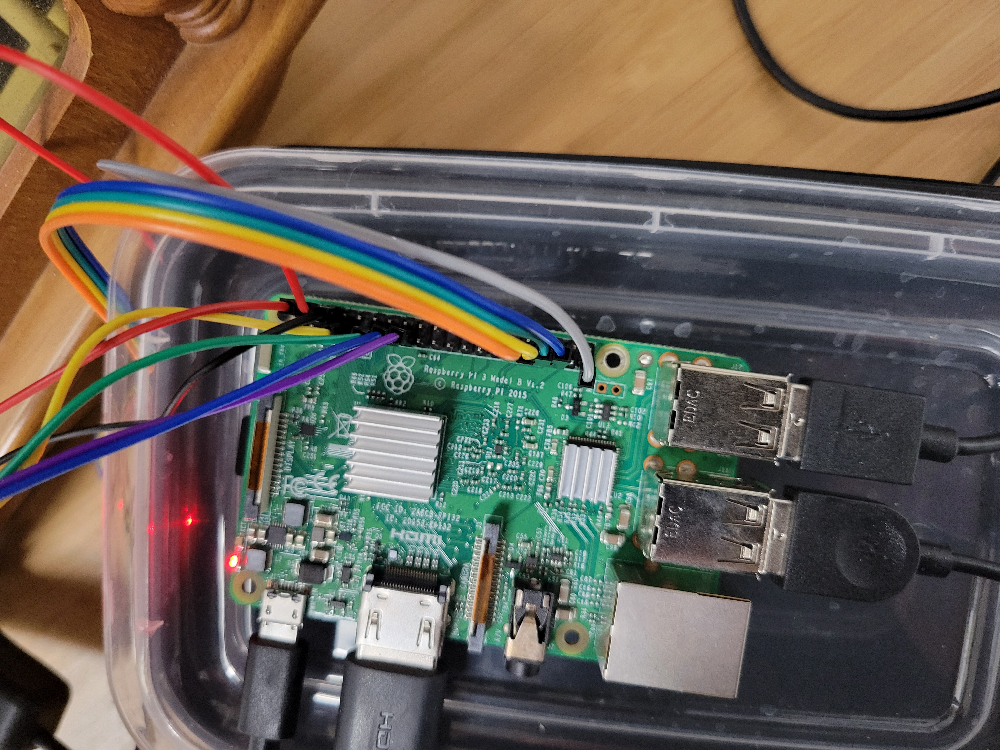

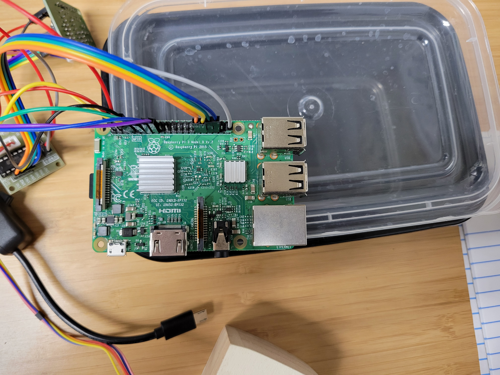
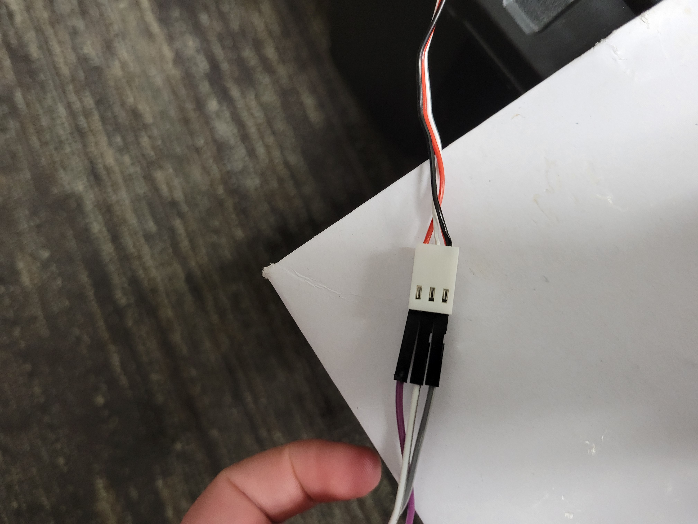

## Your Own Laptop 


### Hotspot
- Make sure your hotspot is plugged in and the pis auto connect to it 
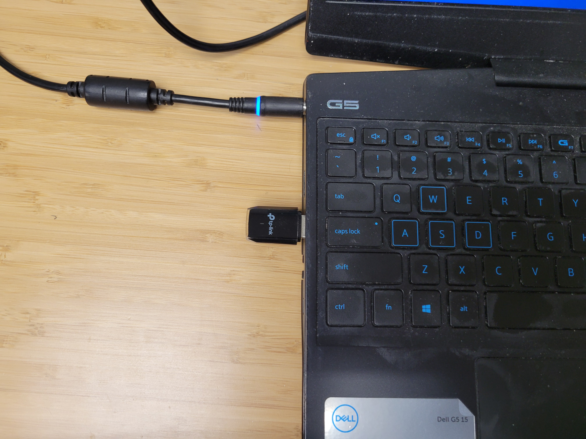

### Make sure Mosquitto is running

```bash
    sudo systemctl enable mosquitto
    sudo systemctl start mosquitto 
```

### Arduino IR receiver 
- arduino plugged in to pi at port='/dev/ttyUSB0' (may need to move ports around)
- Need [HP_Light_Up_Ring.ino](../arduino_files/IR_Remote.ino) 
    - This needs #include <IRremote.h> and #include <IRremoteInt.h> installed. May need an old Arduino version.
- Receiver on **NANO PIN 11** 

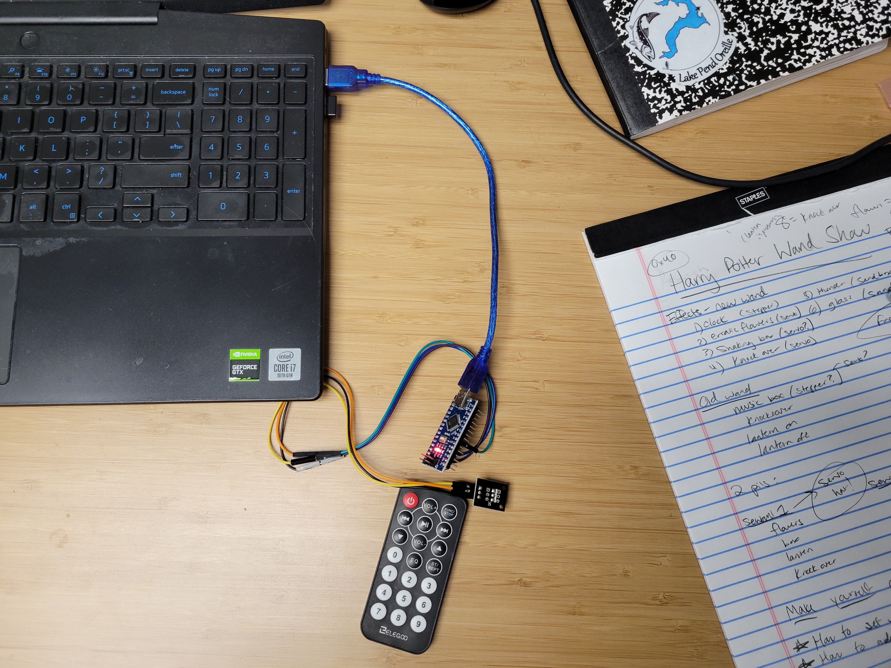

### Speakers 
- Make sure these are installed for sounds. Sounds should be in sounds folder in main repo.  

### Walking Through the Actual Code 
Need pygame installed to play sounds 
[Please see wand_show.py](../wand_show.py)

### Running Commands 
- python3 wand_show.py 
- python3 wand_show.py old 

You can also use wand_show_key.py if IR isn't working. Be careful. May need to copy over. Main difference is that input() function instead of IR 

### Adding a New Effect
- Install hardware on pi & test 
- Software action function goes in <effect_name>.py file 
- Added to appropriate pi/device on topic_action_mapping
- Added to list of possible effects in wand_show with appropriate message


TODO 
- Fan effect
- SD Card Image 
- Tailscale